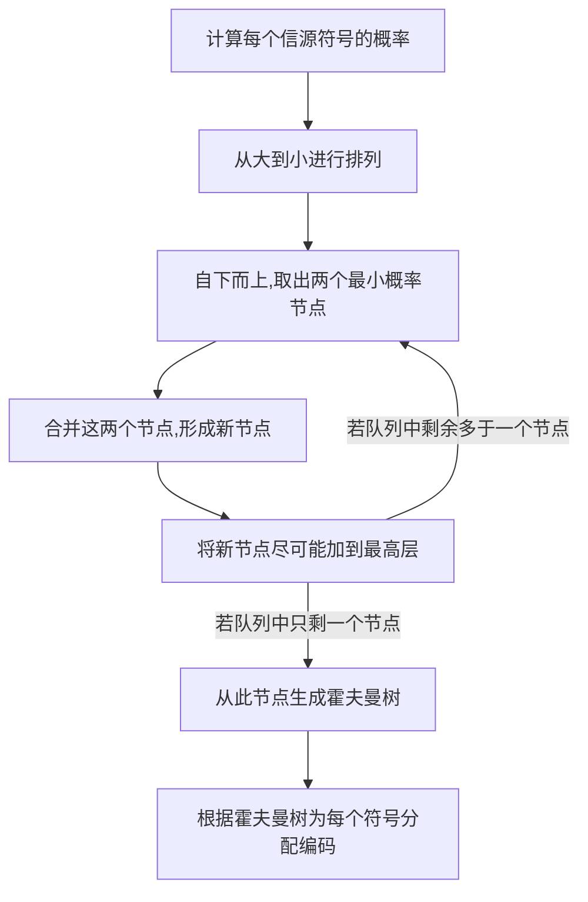

```mermaid
graph TD;
    A[计算每个信源符号的概率] --> B[从大到小进行排列];
    B --> C[自下而上,取出两个最小概率节点];
    C --> D[合并这两个节点,形成新节点];
    D --> E[将新节点尽可能加到最高层];
    E -->|若队列中剩余多于一个节点| C;
    E -->|若队列中只剩一个节点| F[从此节点生成霍夫曼树];
    F --> G[根据霍夫曼树为每个符号分配编码];

```

